# Chat 與 Artifact 面板的錯誤畫面（2026-09-18，臨時 branch）

每一張都是用假 API 製造出來的狀態，對應 feat/iframe-postmessage 最新 commit。底部與圓窗的中秋裝飾是因為今天已在中秋前 14 天的區間內，實機也會這樣。

## 對話欄整塊載入失敗

| 情境 | 畫面 |
|---|---|
| `GET /sessions/:id` 回 502 |  |
| `GET /sessions/:id` 回 404（對話在別處被刪） |  |
| 後端連不上（連線被拒） |  |
| 只有 composer 的周邊讀取失敗（`/connectors` 500），對話仍可讀 | 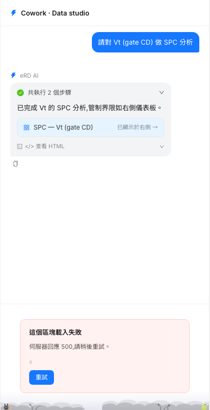 |

## 執行中或執行後的錯誤

| 情境 | 畫面 |
|---|---|
| 串流送出 `ERROR` 事件，歷史沒有記到任何回覆：泡泡留著，紅字是後端的 message |  |
| 串流失敗，但後端有把 agent 自己的說法存進歷史：泡泡交棒，只剩歷史那列與步驟摘要的紅 ✗ | 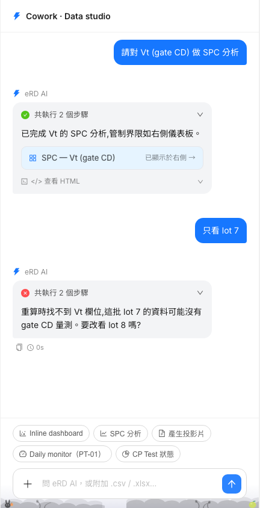 |
| `POST /messages` 直接被拒（503，帶 code 與 message） |  |
| 串流中途斷線 |  |
| 後端記下的「回應已中斷」紀錄，旁邊有重新嘗試 |  |
| 檔案超過保留期：composer 上方提示、檔案標「已過期」、送出被擋 | 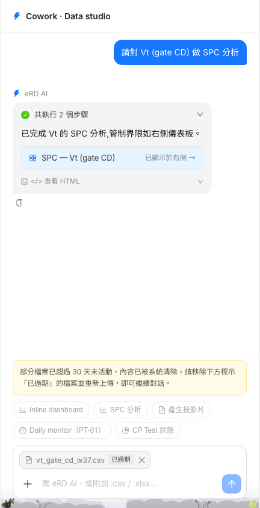 |

## Artifact 執行錯誤與修復

| 情境 | 畫面 |
|---|---|
| iframe 丟出 JS 錯誤 → 對話欄底部的修復提議 | 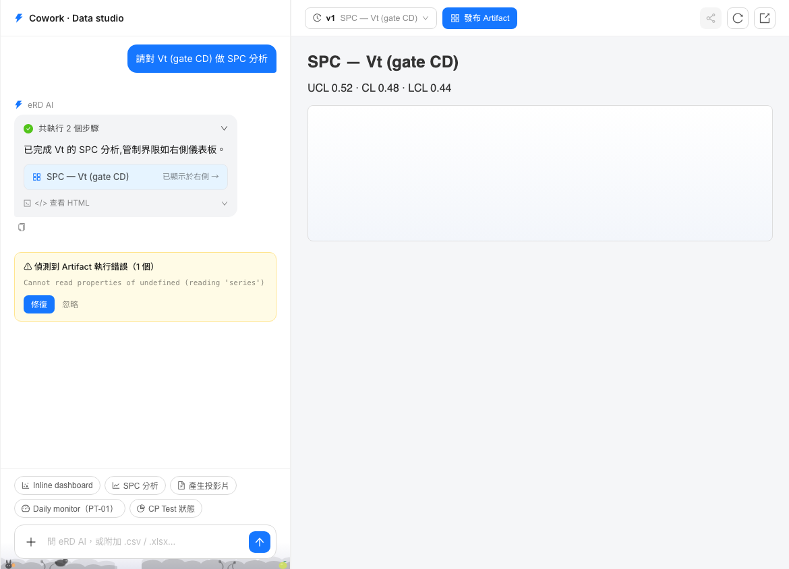 |
| 按修復，後端回 `repaired: false` | 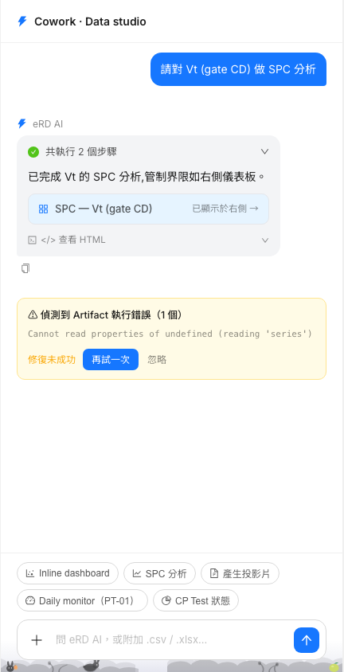 |
| 再試一次，後端回 409 `FILES_EXPIRED` | 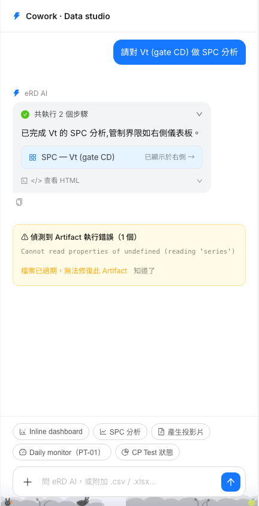 |
| Artifact 透過 MCP bridge 呼叫工具，後端回 400 `INVALID_CALL` → 同一種提議 | 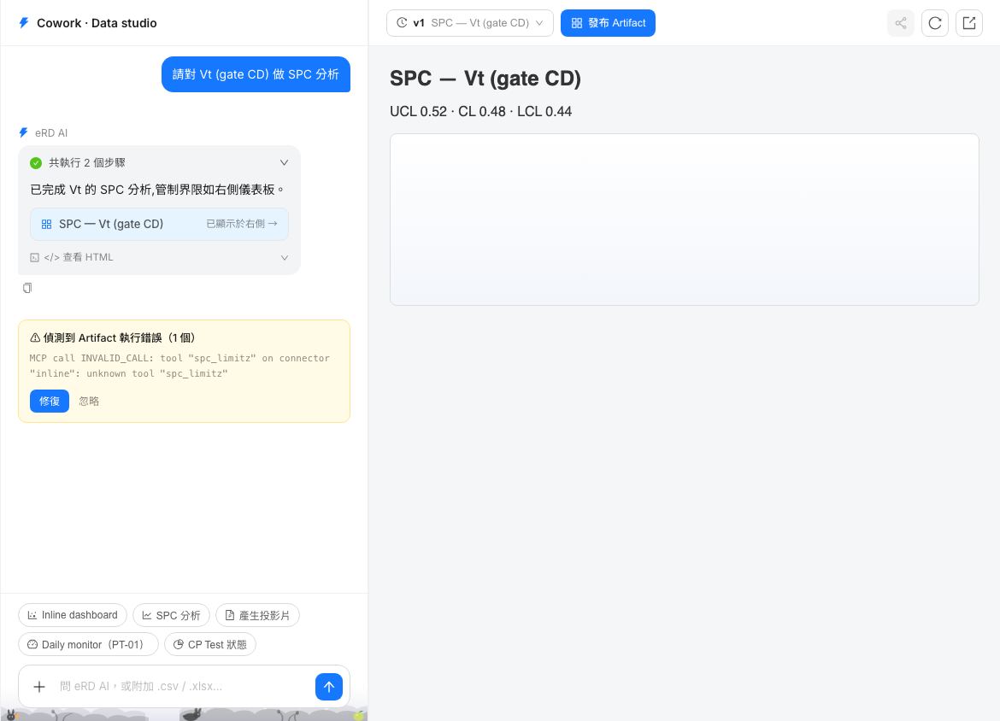 |

## Artifact 面板

| 情境 | 畫面 |
|---|---|
| `GET /artifacts/:id` 回 500：版本列與工具列都在，只有內容區說載入失敗 | 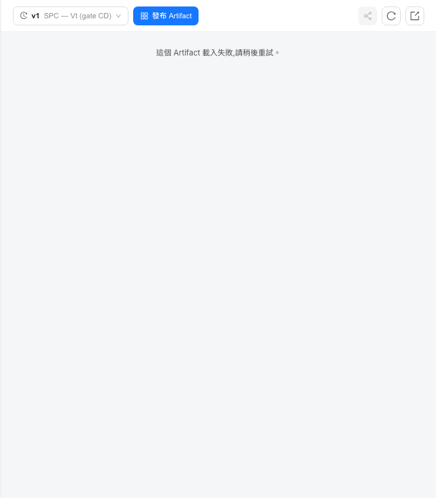 |
| `GET /artifacts/:id` 回 404：說已不存在，請從版本選單挑別的 | 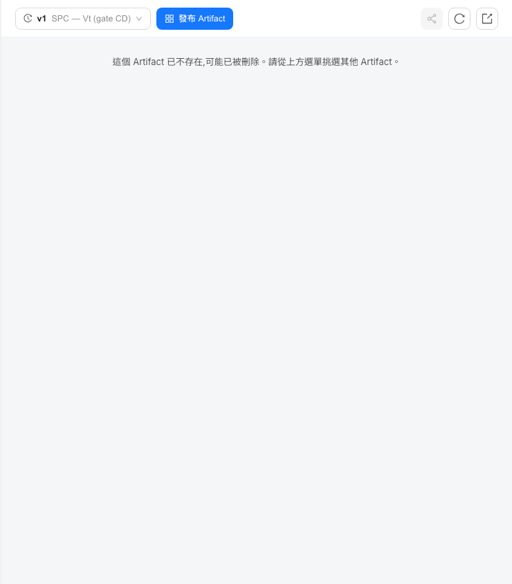 |
| `GET /artifacts`（清單）回 500：側邊欄整塊倒下，兩個面板退回空狀態 | 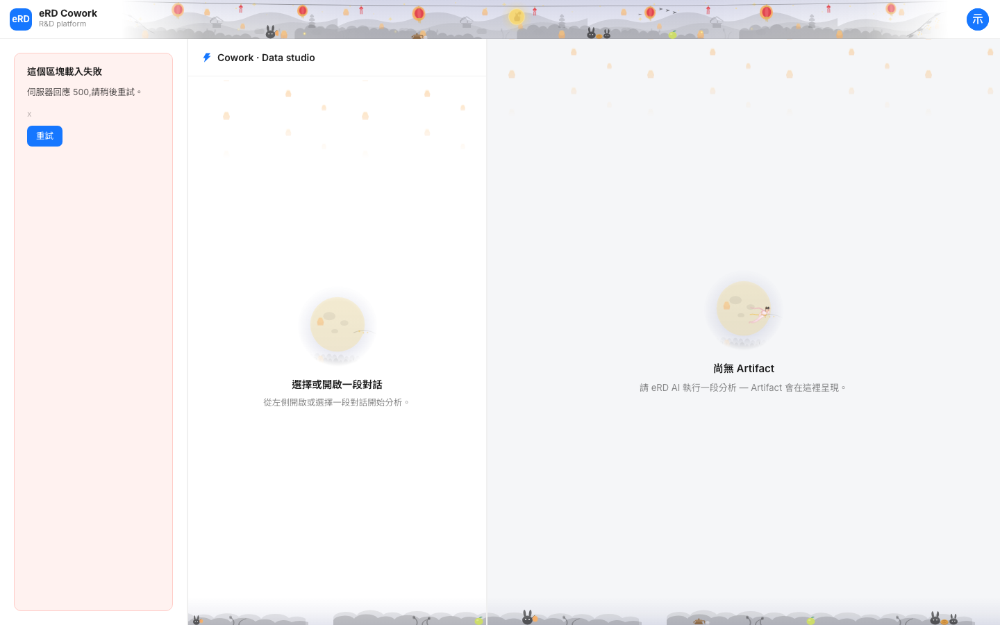 |

## 整個 app

| 情境 | 畫面 |
|---|---|
| `GET /sessions` 回 403 `ENTITLEMENT_DENIED`：整頁蓋住，顯示後端自己的說明 | 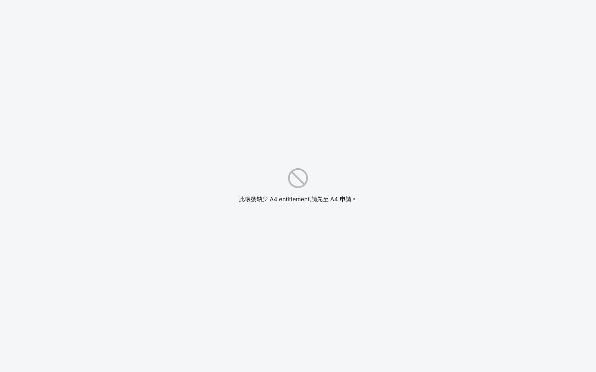 |
| 某個操作失敗（釘選回 500）：右上角 toast | 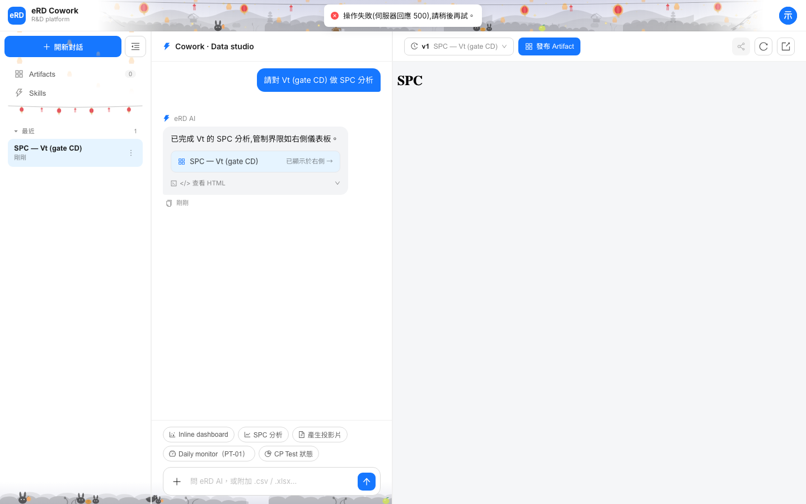 |
