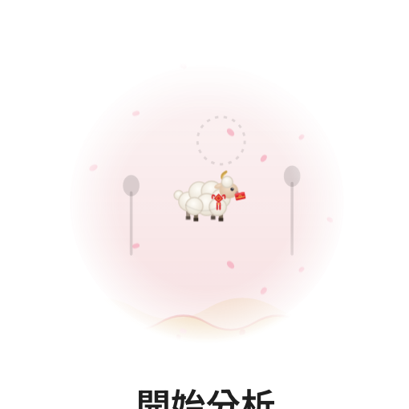
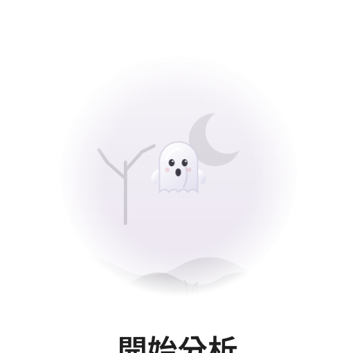
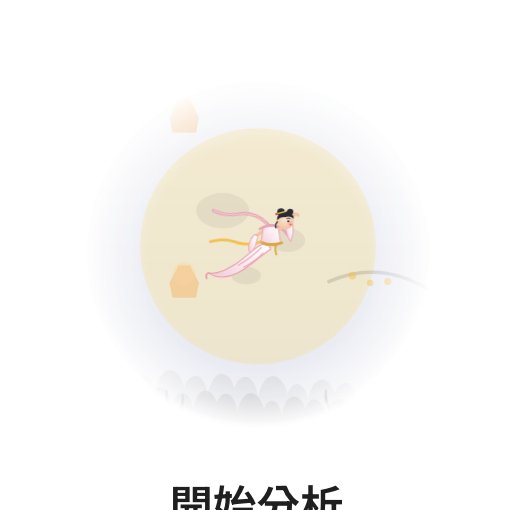

# 節慶裝飾截圖（2026-09-18 第二版，臨時 branch，看完即刪）

對應最新 commit。第五版：圓窗角色換成聖誕老公公、羊、小幽靈、嫦娥（20 到 34）。第四版：地帶改成無縫拼貼、分遠近兩層，卡片兩側各站一件小東西（40 到 45 與整頁）。這一版改了兩件事：對話欄的地面從 composer 後面穿過（不再斷層）；圓窗留下，畫法改成同一個世界的，四個節日各一隻生物。

## 整頁

| | |
|---|---|
| 聖誕 |  |
| 新年 |  |
| 萬聖節 |  |
| 中秋 |  |

## 地面連過 composer 後面

| | |
|---|---|
| 聖誕 |  |
| 新年 |  |

## 圓窗（第七版）：駕雪橇的聖誕老公公、掛中國結叼紅包的羊、小幽靈、嫦娥

| | |
|---|---|
| 聖誕：聖誕老公公駕雪橇 |  |
| 新年：掛中國結、叼紅包的羊 |  |
| 萬聖節：小幽靈 |  |
| 中秋：月裡的嫦娥 |  |

## 出窗、橫越到另一個面板

| | |
|---|---|
| 聖誕老公公 |  |
| 羊 |  |
| 小幽靈 |  |
| 嫦娥 |  |
| 墓碑後面改成殭屍的手（滑過時） |  |

## 第四版：地帶拼貼、遠近兩層、卡片兩側有東西

| | |
|---|---|
| 聖誕 |  |
| 新年 |  |
| 萬聖節 |  |
| 中秋 |  |
| 聖誕深色 |  |
| 收合欄 |  |
