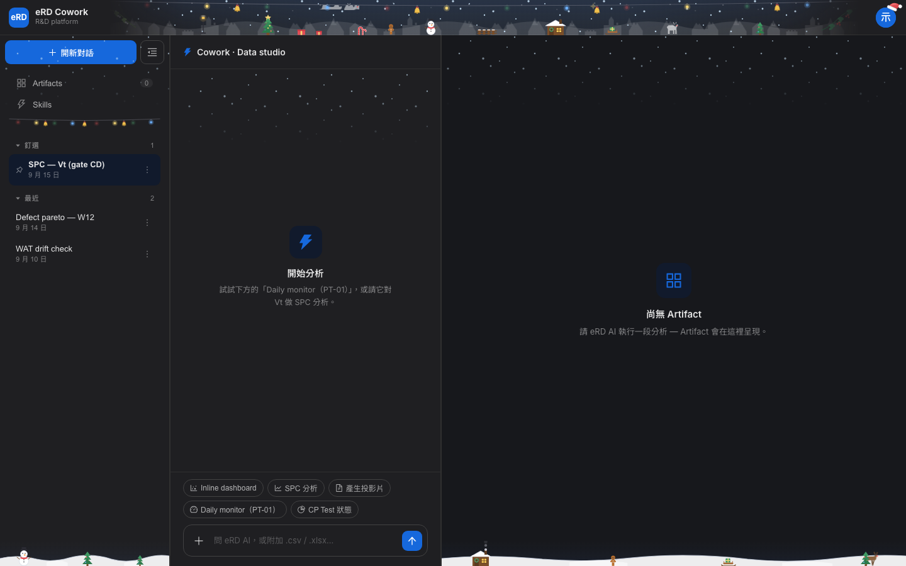
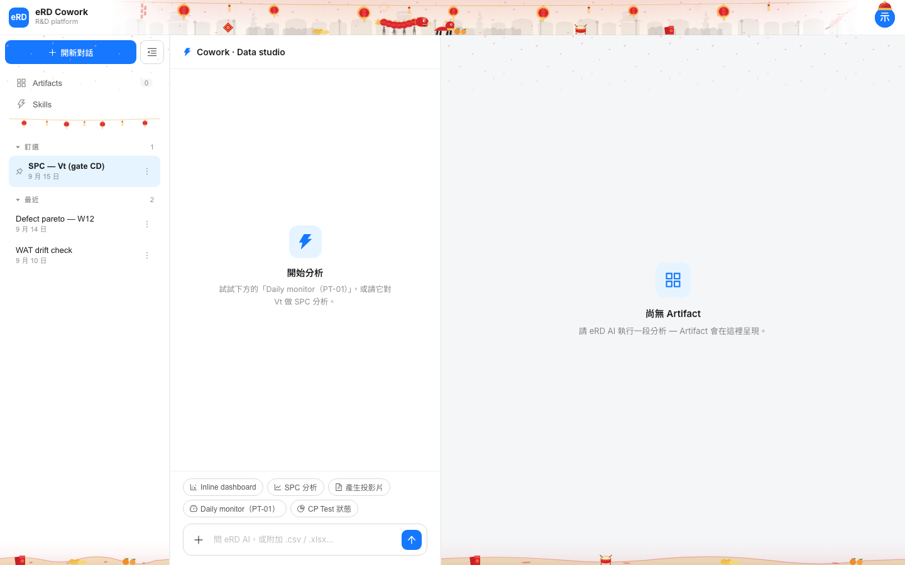
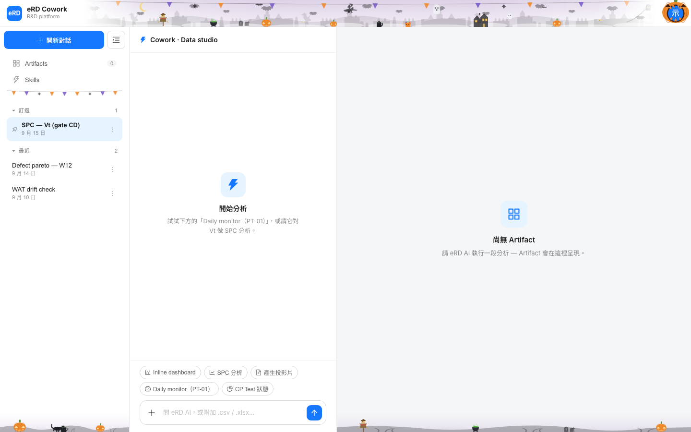
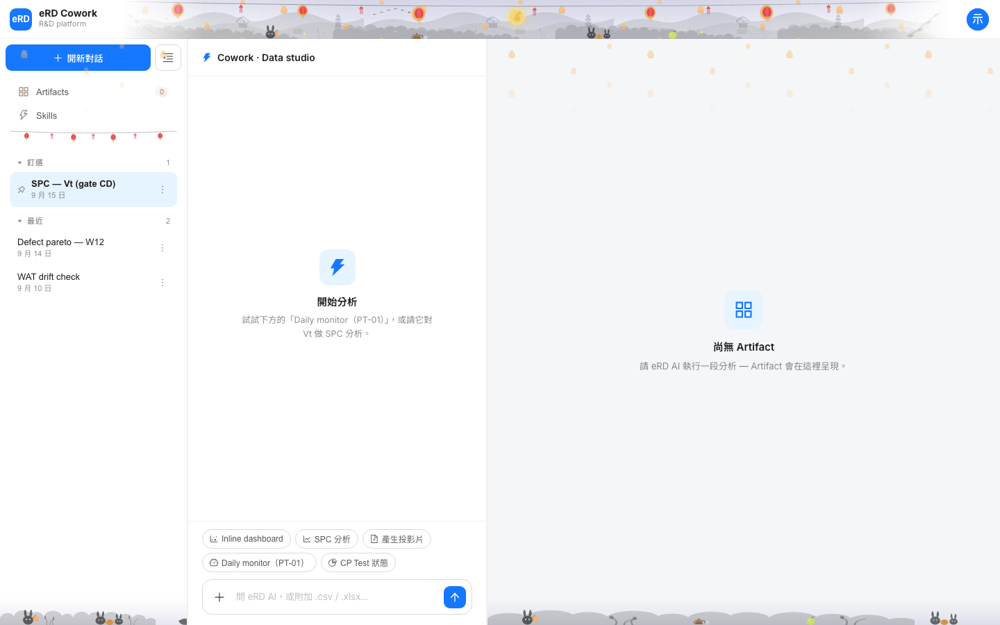
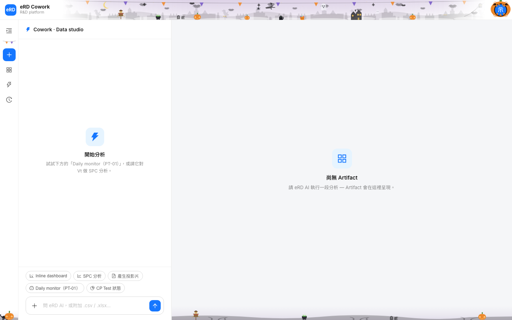

# 節慶裝飾截圖（2026-09-18，臨時 branch，看完即刪）

對應 commit 51eb0a7「節慶裝飾收成一個世界」。假資料是 repo 既有的虛構值。

## 整頁

| | |
|---|---|
| 聖誕 |  |
| 聖誕深色 |  |
| 新年 |  |
| 萬聖節 |  |
| 中秋 |  |
| 收合欄 |  |

## 角色走過整條地面

| | |
|---|---|
| 馴鹿在側邊欄 |  |
| 馴鹿從對話欄後面走出來 |  |
| 舞獅同一個位置 |  |
| 馴鹿在 Artifact 地面 |  |
| 黑貓在 Artifact 地面 |  |

## 點擊的瞬間

| | |
|---|---|
| 大鍋冒泡 |  |
| 茶壺冒煙 |  |
| 鼓槌敲擊 |  |
| 薑餅人跳 |  |
