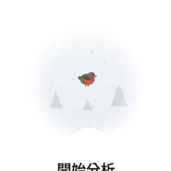
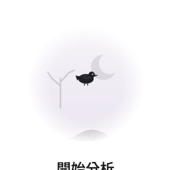
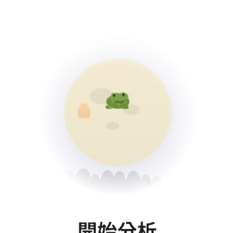

# 節慶裝飾截圖（2026-09-18 第二版，臨時 branch，看完即刪）

對應 commit 5188418。第三版：地帶改成一整條，三個面的邊界接得上、一樣亮（40 到 45）。這一版改了兩件事：對話欄的地面從 composer 後面穿過（不再斷層）；圓窗留下，畫法改成同一個世界的，四個節日各一隻生物。

## 整頁

| | |
|---|---|
| 聖誕 |  |
| 新年 |  |
| 萬聖節 |  |
| 中秋 |  |

## 地面連過 composer 後面

| | |
|---|---|
| 聖誕 |  |
| 新年 |  |

## 圓窗：同一片天氣、同一條地，各住一隻

| | |
|---|---|
| 新年：錦鯉 |  |
| 聖誕：知更鳥 |  |
| 萬聖節：烏鴉 |  |
| 中秋：月裡的蟾蜍 |  |

## 出窗、橫越

| | |
|---|---|
| 錦鯉剛出窗，玻璃留下一圈 |  |
| 知更鳥飛過 Artifact 面板 |  |
| 錦鯉橫越 |  |
| 蟾蜍橫越 |  |

## 第三版：地帶在三個面的邊界接起來

| | |
|---|---|
| 聖誕 |  |
| 新年 |  |
| 萬聖節 |  |
| 中秋 |  |
| 聖誕深色 |  |
| 收合欄 |  |
